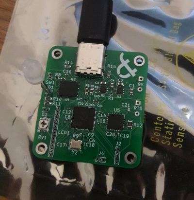

# Simple temperature meter

A simple 15-bit digital temperature meter capable of reading temperatures ranging from –200C to 500C (dependent on reference resistor and used probe). The meter is designed to work with platinum resistance temperature detectors PT100 and PT1000, which are converted into digital values with the usage of a MAX31865 ADC with a nominal temperature resolution of 0.03125C over full range.  

## Main components

- MAX31865 15-Bit ADC
- RP2040 MCU
- TPS7A26 linear voltage regulator

